# REPORT OF DNS RELAY SERVER

**Course Title:** Design and implementation of a DNS Relay

**Group Member:**

- Wang Zaitian (2019213481)
- Zhang Zeyu (2019213482)

**Date:** 2022/7/2

[TOC]

## 0. Overview

The aim of this project is to design and implement a DNS relay that connects clients with remote DNS servers. Typically, when a user program is trying to interact with the domain name space, it sends queries directly to the remote DNS server. In this design, the DNS relay works as a local DNS server or resolver whom the clients resort to, and takes the role of connecting to remote DNS server. The new domain system configuration has three benefits. First, it can ease the burden of remote DNS servers by replying to clients with its own DNS cache. Second, it increases Internet connection speed by using local DNS cache, which is faster than remote DNS server. Third, it can block some undesired connection to the Internet by adding certain domain names to blacklist.

## 1. Requirement Analysis

### 1.1. Functional Requirements

The DNS relay should be able to:

1. Listen to port 53 for DNS queries
2. Receive and resolve DNS query messages
3. Retrieve IPs for the domain name queried in local cache
4. Query the remote DNS server if IP not found in cache
5. Receive remote DNS server reply and fetch the returned IPs
6. Pack the IP from cache or remote DNS server in a reply message
7. Respond the client with this message containing the IP address
8. Block queries for domains that are recorded in blacklist
9. Support multi-threading to given best performance
10. Log connection and  operation information.

### 1.2. Non-functional Requirements

1. The software works on **Windows** or Linux
2. The program is written is C, C++, or **Java**

## 2. Overall Design

### 2.1. Basic Principles

#### 2.1.1. Function of DNS Relay

The DNS relay server is deployed between client and remote DNS server *(Figure 1)*. By adding additional functional modules to this server, we can achieve **additional functions** such as local caching, blacklisting, traffic control, etc.

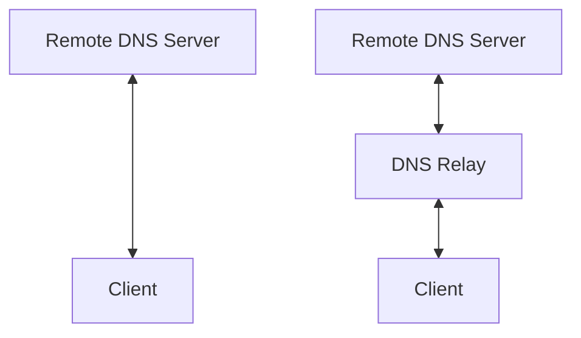

<center><b><font size ='2'>Figure 1. Traditional v.s. DNS relay</font></b></center>

#### 2.1.2. Data Flow

The *Figure 2* below shows the data flow of the whole system.

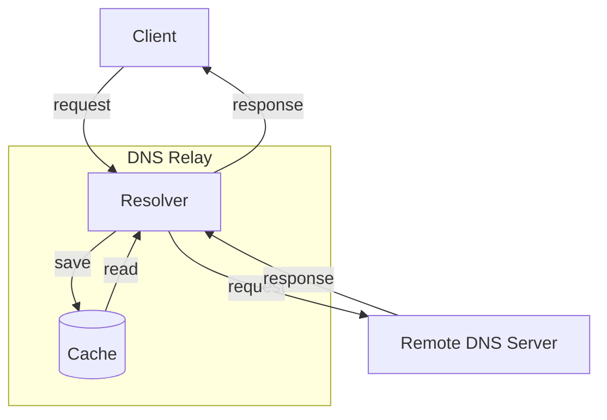

<center><b><font size ='2'>Figure 2. Functional Modules</font></b></center>

Client first sends an capsulate UDP datagram request to the resolver. The resolver decapsulates the request and checks if the request domain is cached. If the result is found in cache, it encapsulates the result into a packet and sends it back to the client. Otherwise, it should relay the request to the remote DNS server, and then pass the server's response back to the client. Note that this is just the basic structure of DNS relay which only add a function of local caching.

#### 2.1.3. DNS Datagram

We have to implement a parser to resolve the DNS datagrams received as well as encapsulate the answers into datagrams for sending. But before that, we must first have a good understanding about each section of the datagram.

An instance of DNS datagram, or DNS message includes **DNS Header** and four sections, among which the first two, **Question Section** and **Answer Section** are considered in this project.

```
        +---------------------+
        |        Header       |
        +---------------------+
        |       Question      | the question for the name server
        +---------------------+
        |        Answer       | RRs answering the question
        +---------------------+
        |      Authority      | RRs pointing toward an authority
        +---------------------+
        |      Additional     | RRs holding additional information
        +---------------------+
```

<center><b><font size ='2'>Figure 3. DNS Datagram</font></b></center>

##### 2.1.3.1. DNS Header

The header section of DNS datagram is shown in *Figure 3*. ID is randomly generated by client. And flags indicate some properties of the datagram. In this specific DNS relay application, we only need to care about the **RCODE**. When we get no result for the requested domain or the domain is in the blacklist, we should set RCODE to 3<sub>d</sub>, which means no result. The rest of the header section only needs to be **cloned** to the response datagram without modification.

```
 0  1  2  3  4  5  6  7  8  9  10 11 12 13 14 15
+--+--+--+--+--+--+--+--+--+--+--+--+--+--+--+--+
|                      ID                       |
+--+--+--+--+--+--+--+--+--+--+--+--+--+--+--+--+
|QR|  opcode   |AA|TC|RD|RA|   Z    |   RCODE   |
+--+--+--+--+--+--+--+--+--+--+--+--+--+--+--+--+
```

<center><b><font size ='2'>Figure 4. DNS Header</font></b></center>

##### 2.1.3.2. DNS Question

*Figure 4* below shows the structure of DNS question section. **QNAME** contains the requested domain. For example, `www.github.com` is represented as `3www6github3com0`. **QTYPE** indicates different question types. *Table 1* shows the QTYPE commonly used. QCLASS = 1 means Internet data.

```
 0  1  2  3  4  5  6  7  8  9  10 11 12 13 14 15
+--+--+--+--+--+--+--+--+--+--+--+--+--+--+--+--+
|                    QNAME                      |
+--+--+--+--+--+--+--+--+--+--+--+--+--+--+--+--+
|                    QTYPE                      |
+--+--+--+--+--+--+--+--+--+--+--+--+--+--+--+--+
|                    QCLASS                     |
+--+--+--+--+--+--+--+--+--+--+--+--+--+--+--+--+
```

<center><b><font size ='2'>Figure 5. DNS Question</font></b></center>

| Type  | Code in Decimal | Description            |
| ----- | --------------- | ---------------------- |
| A     | 1               | Request IPv4 address   |
| AAAA  | 28              | Request IPv6 address   |
| CNAME | 5               | Request canonical name |
| PTR   | 12              | Request inverse DNS    |

<center><b><font size ='2'>Table 1. Common QTYPE</font></b></center></font>

##### 2.1.3.3. DNS Answer

We only need to fill the **RDLENGTH** and **RDATA** in the response packet while the rest of the sections only need to be simply cloned. For the DNS relay implementation, only **ARecord**s and **AAAARecord**s need to be attached. This should be achieved by simply calling the `addRecord()` function in our parser.

```
  0  1  2  3  4  5  6  7  8  9  10 11 12 13 14 15
 +--+--+--+--+--+--+--+--+--+--+--+--+--+--+--+--+
 |                     NAME                      |
 +--+--+--+--+--+--+--+--+--+--+--+--+--+--+--+--+
 |                     TYPE                      |
 +--+--+--+--+--+--+--+--+--+--+--+--+--+--+--+--+
 |                     CLASS                     |
 +--+--+--+--+--+--+--+--+--+--+--+--+--+--+--+--+
 |                      TTL                      |
 +--+--+--+--+--+--+--+--+--+--+--+--+--+--+--+--+
 |                    RDLENGTH                   |
 +--+--+--+--+--+--+--+--+--+--+--+--+--+--+--+--+
 |                     RDATA                     |
 +--+--+--+--+--+--+--+--+--+--+--+--+--+--+--+--+
```

<center><b><font size ='2'>Figure 6. DNS Question</font></b></center>

#### 2.1.4. Possible Datagram

We use **Wireshark** to capture the possible DNS datagram during the whole process. This is very enlightening for us to design and implement the DNS relay.

First use `nslookup` command to request [www.google.com](www.google.com). It returns both an IPv4 address and an IPv6 address(*Figure 6*).

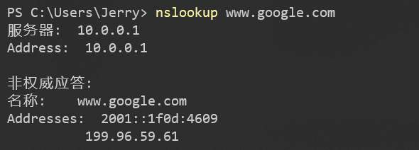

<center><b><font size ='2'>Figure 7. nslookup Request 1</font></b></center>

Then we observe the packets exchange captured in Wireshark in detail(*Figure 7)*. As we can see, a inverse DNS request is firstly sent from port 53 to the remote DNS server(10.0.0.1). After receiving the response, type A and AAAA request and response happens in sequence.

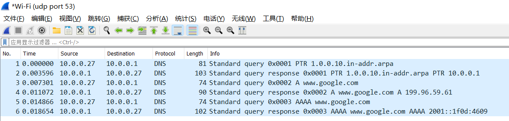

<center><b><font size ='2'>Figure 8. Packets Captured 1</font></b></center>

We also tried the IPv6-only website(*Figure 8*). This is similar to IPv4-only.

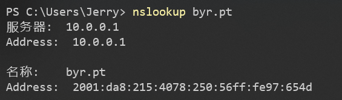

<center><b><font size ='2'>Figure 9. nslookup Request 2</font></b></center>

Compare the type A response(*Figure 9*) with the previous one, we found that the **flags** are identical but the latest one has no **Answers** section since [byr.pt](byr.pt) is a IPv6-only website.

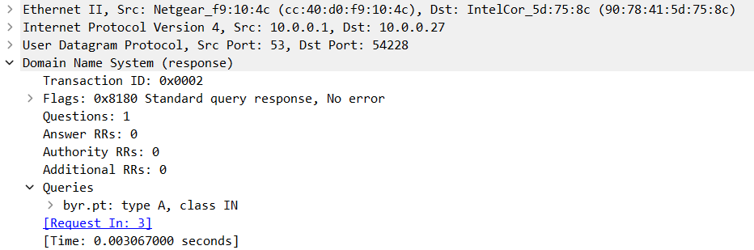

<center><b><font size ='2'>Figure 10. Packets Captured 2</font></b></center>

Finally, We tested the case that the domain doesn't exist(*Figure 10*).

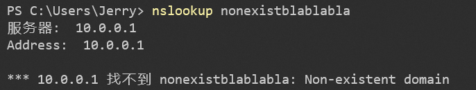

<center><b><font size ='2'>Figure 11. nslookup Request 3</font></b></center>

And we found that both type A and type AAAA response have no **Answers** section and the RCODE are set to 3<sub>d</sub>(Figure 11), indicating that no such domain has been found.

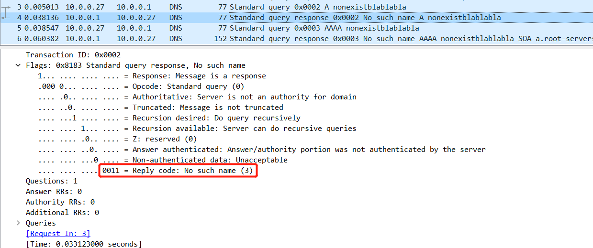

<center><b><font size ='2'>Figure 12. Packets Captured 3</font></b></center>

### 2.2. Advanced Server Function Design

#### 2.2.1. IPv6 Support

- Identify the question type and add corresponding records to the answer section.
- Store ipv4 and ipv6 addresses separately in cache.

#### 2.2.2. Load Balancing

- **Averaging** the traffic by distributing IP addresses equally to each request.
- Only necessary when a large number of requests are received in a short period of time.
- Implement load balancing by simply returning one address **randomly** can get a nice effect.

#### 2.2.3. Customizable Server Configuration

- Create **boot.properties** as the config file of the DNS relay server.
- Stores server settings in it and can be edited by users.
- Read configurations at the beginning of the program an set as instance vars.
- Use **default** settings if config load failed.

#### 2.2.4. Configurable Cache Auto-cleaning

- Add an attribute of cache limit in boot.properties.
- Initialize a scheduled executor **service** at the beginning of the main thread.
- The service will run once first and wake up every **24 hours**.
- The service **clears** the expired cache and **updates** cache map in RAM.

#### 2.2.5. Blacklist with Expiry Time

- If the returned address is [0.0.0.0](0.0.0.0) (for IPv4) or [::](::) (for IPv6), then the requested domain is in **blacklist**. The program will set the **RCODE** to 3<sub>d</sub> and send the response.
- Set the **timestamp** to a chosen date and the cache **cleaning** service will delete 

#### 2.2.6. Configurable remote DNS server

- Add an attribute of the remote DNS server IP in boot.properties.
- Get it from instance var and **encapsulate** into datagram when need to send request to the remote server.

#### 2.2.7. Configurable Cache Usage

- Add an attribute of cache usage IP in boot.properties.
- **Skip** finding result in cache and request to remote server directly of it is set to FALSE.

#### 2.2.8. Configurable Multithreading

- Add an attribute of thread pool size in boot.properties.
- Initialize a **thread pool** of the given size.
- When the main thread **receives** a request, **pick** a new thread from the thread pool and start the **resolver** task in the new thread.

#### 2.2.9. Logging

- Implement a log class which can generate logs and save **locally**.
- The log records the behaviour of the server in detail.
- **Print** to the terminal simultaneously.

### 2.3. Module Decomposition

The following treemap shows the module decomposition of the whole system.

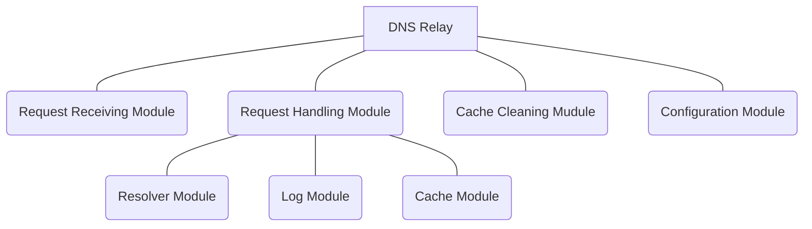

<center><b><font size ='2'>Figure 13. Module Tree</font></b></center>

### 2.4. Overall Flow

Below you can see the major **work flow** of our relay system(cache cleaning module excluded). For detailed description see [Module Design](#3. Module Design) right below.


<center><b><font size ='2'>Figure 14. Overall Flowchart</font></b></center>

## 3. Module Design

### 3.1 Request Receiving Module

First prepare a packet with buffer to store the request received later.

```java
byte[] buf = new byte[1024];
DatagramPacket request = new DatagramPacket(buf, buf.length);
```

DNS Protocol uses port 53 to transfer data, so we need to create a socket and bind it to port 53 to receive the packet.

```java
DatagramSocket socket;
try {
    socket = new DatagramSocket(53);
} catch (SocketException e) {
    throw new RuntimeException(e);
}
```

When a request is sent to the socket, we can get it by:

```java
try {
    socket.receive(request);
} catch (IOException e) {
    e.printStackTrace();
}
```

And if there is no traffic, the thread will be blocked at `DatagramSocket.receive()`. 

The `receive()` method runs infinitely in a while loop without handling the request to boost performance. And requests are handled by child threads from a pool with our request handler.

```java
pool.execute(new Handler(request, socket, cache, new Log(), remoteDnsServer, useCache));
```

The workflow of this part can be understood as below.

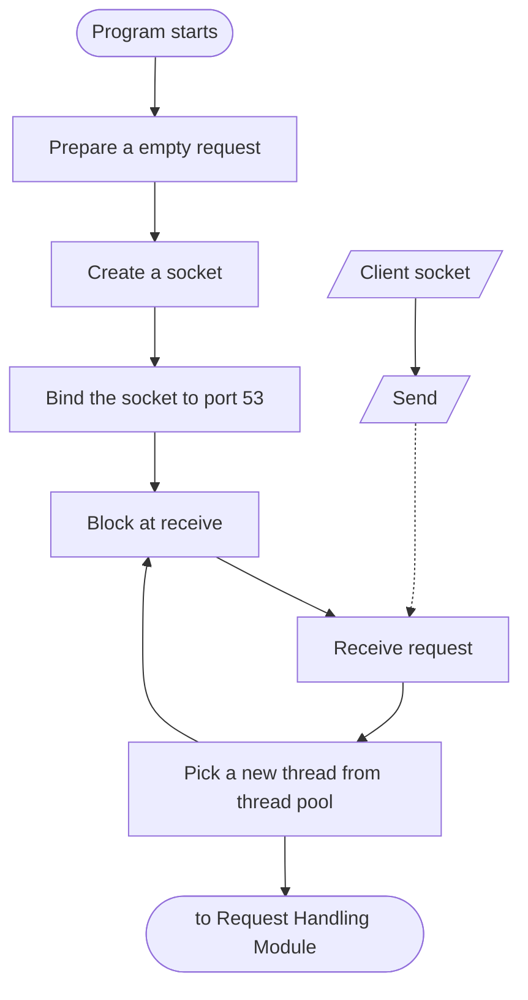

<center><b><font size ='2'>Figure 15. Request Receiving Module flowchart</font></b></center>

### 3.2 Request Handling Module

This is the core part of the DNS relay program. The request handling module provides a service that works in a child thread from the thread pool. Instances of the handler in the multiple threads work independently to resolve the requests, compare with local cache, communicate with remote DNS server, and give reply to the original sockets. **These functions are carried out by the resolver module, a major submodule of request handling module.** Other submodules include log module and cache module.

The request handler instance is created with the received request, the socket that transfer that request, a mapping of the local cache, a logger, and configuration variables.

```java
public static class Handler implements Runnable {
    //...
    public Handler(DatagramPacket request, DatagramSocket socket,
                   Cache cache, Log log, String remoteDnsServer, boolean useCache) {
        this.request = request;
        this.socket = socket;
        this.log = log;
        this.remoteDnsServer = remoteDnsServer;
        this.useCache = useCache;
        if (useCache)
            this.cache = cache;
    }
     @Override
        public void run() {/*...*/}
}
```

#### 3.2.1 Resolver Module

The resolver module first decapsulate the received request packet, extracting the source address and port.

```java
InetAddress srcIp = request.getAddress();
int srcPort = request.getPort();
```

Then it extract the message contained in the request, and then the question, the domain asked, and the question type.

```java
Message messageIn;
try {
	messageIn = new Message(request.getData());
} catch (IOException e) {
	throw new RuntimeException(e);
}
Record question = messageIn.getQuestion();
String domain = question.getName().toString();
int type = question.getType();
```

For reference, vide [section 2.1.3](# 2.1.3.-DNS-Datagram) to see the structure of DNS message.

On finishing decapsulating the request, the resolver first checks the question type. 

##### 3.2.1.1 Question of Type A or AAAA

This project mainly deals with type A, querying an IPv4 address, and type AAAA, querying an IPv6 address. For these two cases, the resolver compare the domain name with its local cache. If the address is found in cache, it fetches the address for response.

```java
ansIp = cache.getIpFromCache(domain + (useV6 ? "-v6" : ""));
```

And if the address is not found in cache, the resolver create a socket and query the remote server. 

```java
//prepare relay socket
DatagramSocket relaySocket = new DatagramSocket();
//prepare relay request packet
byte[] relayBuf = messageIn.toWire();
InetAddress dnsSeverIp = InetAddress.getByName(remoteDnsServer);
DatagramPacket relayRequest = new DatagramPacket(relayBuf, relayBuf.length, dnsSeverIp, 53);
//prepare relay response packet
byte[] buf = new byte[1024];
DatagramPacket relayResponse = new DatagramPacket(buf, buf.length);
//do relay
relaySocket.send(relayRequest);
relaySocket.receive(relayResponse);
relaySocket.close();
```

From the relay response, the resolver extracts the message and answer section.

```java
Message messageResponse = new Message(relayResponse.getData());
List<Record> records = messageResponse.getSection(Section.ANSWER);
```

Records are then converted to objects of `InetAddress` type.

```java
ArrayList<InetAddress> ips = new ArrayList<>();
for (Record record : records) {
    if (!useV6 && record instanceof ARecord) {
        // ipv4 records
        ARecord aRecord = (ARecord) record;
        InetAddress ip = InetAddress.getByAddress(aRecord.getAddress().getAddress());
        ips.add(ip);
    } else if (useV6 && record instanceof AAAARecord) {
        // ipv6 records
        AAAARecord aaaaRecord = (AAAARecord) record;
        InetAddress ip = InetAddress.getByAddress(aaaaRecord.getAddress().getAddress());
        ips.add(ip);
    }
}
```

For load balancing consideration, only one address of the queried domain is randomly selected.

```java
ansIp = ips.get(new Random().nextInt(ips.size()));
```

Up to now, the address of the queried domain is obtained, either by retrieving in the local DNS cache or querying the remote DNS server.

If not in the blacklist (the program compares the address with `0.0.0.0` and `::`), the address is encapsulated in a response packet, and send back to the original socket.

```java
//prepare answer
Record answer;
if (!useV6)	// ipv4 answer
	answer = new ARecord(question.getName(), question.getDClass(), 64, ansIp);
else	// ipv6 answer
	answer = new AAAARecord(question.getName(), question.getDClass(), 64, ansIp);
//prepare message (that contains the answer)
Message messageOut = messageIn.clone();
messageOut.addRecord(answer, Section.ANSWER);
ansIp.toString().substring(1));
//prepare and send the response
byte[] buf = messageOut.toWire();
DatagramPacket response = new DatagramPacket(buf, buf.length);
response.setAddress(srcIp);
response.setPort(srcPort);
socket.send(response);
```

##### 3.2.1.2 Question of Other Types

There are some other types of DNS question in the socket, like CNAME, MX, or inverse DNS. These types only requires simple relay because they do not need load balancing or blacklisting, and are not included in cache. The program simply forward relay response back to the client, and no need to extract the addresses and reformat the message.

```java
relaySocket.receive(relayResponse);
DatagramPacket response = relayResponse;
```

##### 3.2.1.3 Resolver Workflow

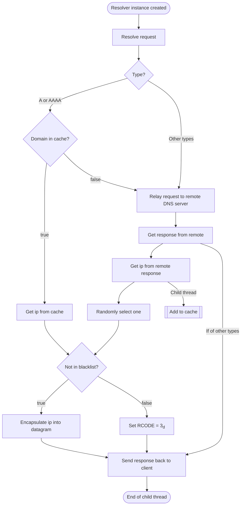

<center><b><font size ='2'>Figure 16. Resolver Flowchart</font></b></center>

In this flow chart, cache and blacklist functions are assumed enabled.

##### 3.2.1.4 DNS Parser

The DNS resolver is supported by a parser package, which has classes to represent DNS components.

Some major classes in this package are `MyMessage`, `MyHeader`, and `MyRecord`.

`MyMessage` class represents the DNS message. It has `header` and `sections` as its fields. And this class implement methods like`getQuestion` and `addRecord`.

```java
public class MyMessage implements Cloneable {
    private MyHeader header;
    private List<MyRecord>[] sections;  //0:question, 1:answer, 2:authority, 3:addition
    private int size;
	//...
    public MyRecord getQuestion() {
        List<MyRecord> l = sections[0];
        if (l == null || l.isEmpty()) {
            return null;
        }
        return l.get(0);
    }
    public void addRecord(MyRecord r, int section) {
        if (sections[section] == null) {
            sections[section] = new LinkedList<>();
        }
        header.increaseCount(section);
        sections[section].add(r);
    }
}
```

`MyHeader` class represents the header of a DNS message. It fields contains `id`, `flags`, and `counts`. Some important methods include `setRcode` and `getFlag`.

```java
public class MyHeader implements Cloneable{
    private int id;
    private int flags;
    private int[] counts;
	//...
    public void setRcode(int value) {
        if (value < 0 || value > 0xF) {
            throw new IllegalArgumentException("DNS Rcode " + value + " is out of range");
        }
        flags &= ~0xF;
        flags |= value;
    }
    public boolean getFlag(int bit) {
        return (flags & (1 << (15 - bit))) != 0;
    }
}
```

`MyRecord` is another class that is often used in this project. It represents DNS message section. This class is often used as its subclasses, `MyARecord` and `MyAAAARecord`. 

```java
public abstract class MyRecord {
    protected MyName name;
    protected int type;
    protected int dclass;
    protected long ttl;
    public MyName getName() {
        return name;
    }
    public int getType() {
        return type;
    }
    public int getDClass() {
        return dclass;
    }
    //...
}
```

#### 3.2.2 Log Module

A log file is used to record connection and operations of the program and provide useful information to expert users. It is basically supported by `Log` class, with `addLog()` method that add log information to the buffer and print them in the terminal, and a `writeLog()` method to flush the buffer into the log file. Each handler thread use a independent log instance and `writeLog()` operation is protected by mutex lock.

Some usage examples of log function are as following.

```java
log.addLog("[" + Thread.currentThread().getName() + "] " + "found in cache");
log.addLog("[" + Thread.currentThread().getName() + "] " + "not in cache");
log.addLog("[" + Thread.currentThread().getName() + "] " + "in total " + ips.size() + " result(s)");
log.writeLog();	//at the end of each thread
```

#### 3.2.3 Cache Module

Local caching is an important feature of this DNS relay program. 

When handling a query, the resolver first tries to retrieve the address in the cache.

```java
ansIp = cache.getIpFromCache(domain + (useV6 ? "-v6" : ""));
```

If not found in cache but addresses are queried from remote DNS server, the resolver create a new child thread to store these address and update the cache file.

```java
Thread update = new Thread(new Runnable() {
    @Override
    public void run() {
        synchronized (cache.getCacheLock()) {
            if (cache.getIpFromCache(domain + (finalUseV6 ? "-v6" : "")) == null) {
                cache.addCacheToFile(domain + (finalUseV6 ? "-v6" : ""), ips);
                log.addLog("[" + parentName + "-child] " + "added to cache file and reloaded cache");
            }
        }
    }
});
```

The flow chart of cache module is shown below.

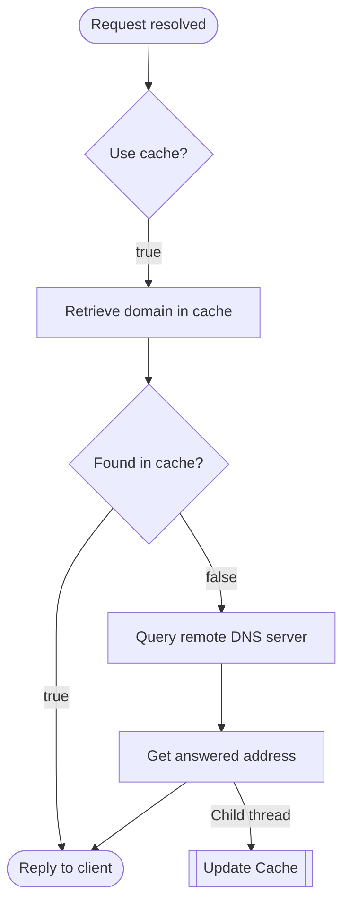

<center><b><font size ='2'>Figure 17. Cache Flowchart</font></b></center>

### 3.3 Cache Cleaning Module

The mapping of domains and addresses are subject to change, so the cache must be regularly flushed and updated to keep track with authority records from remote DNS server. This is implemented by using a task scheduler that triggers the cache cleaning task every day to delete cache records before two days(customizable).

```java
ScheduledExecutorService executorService = Executors.newScheduledThreadPool(1);
executorService.scheduleAtFixedRate(() -> {
    cache.flushCacheFile(cacheLimitInDays);
}, 0, 1, TimeUnit.DAYS);
```

### 3.4 Configuration Module

The project enables several settings, including `use-cache`, `cache-limit-in-days`, `thread-pool-size`, and `remote-dns-server`.

Users can decide if they want to use local caching or always query the remote DNS server, and decide how long the cache records are saved in the cache file. They can use larger thread pool size to support more traffic, or use a smaller one to reduce memory and CPU burden. And users can decide the address of the remote DNS server used by the resolver. For example, for users at BUPT campus, they can set the address as `10.3.9.44` to use DNS server provided by BUPT. 

This configuration module is supported by Java `Properties` class, and the implementation is as following.

```java
Properties config = new Properties();
try {
    FileInputStream in = new FileInputStream("boot.properties");
    config.load(in);
    in.close();
    useCache = Boolean.parseBoolean(config.getProperty("use-cache", "true"));
    cacheLimitInDays = Integer.parseInt(config.getProperty("cache-limit-in-days", "2"));
    threadPoolSize = Integer.parseInt(config.getProperty("thread-pool-size", "10"));
    remoteDnsServer = config.getProperty("remote-dns-server", "114.114.114.114");
    log.addLog("config loaded");
} catch (IOException ignored) {
    log.addLog("config load failed, use default settings");
}
```

The default configuration is listed in `boot.properties` file.

```properties
use-cache=true
cache-limit-in-days=2
thread-pool-size=10
remote-dns-server=114.114.114.114
```

## 4. Testing & Results

### 4.1 Using `nslookup`

First of all, execute the DNS relay program. Then enter `nslookup example.com 127.0.0.1` in the terminal. Some examples are listed below.

- Querying [www.google.com](www.google.com), which support both **IPv4** and **IPv6**:

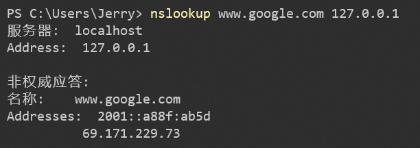

<center><b><font size ='2'>Figure 18. nslookup - 1</font></b></center>

- Querying [byr.pt](byr.pt), a pure **IPv6** website:

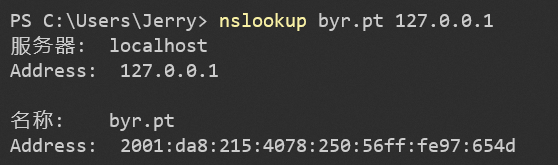

<center><b><font size ='2'>Figure 19. nslookup - 2</font></b></center>

- Querying a **nonexistent** domain, whose address should not be found:

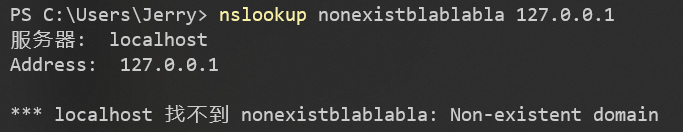

<center><b><font size ='2'>Figure 20. nslookup - 3</font></b></center>

- The relay program support all kinds of question type, say type **MX**:

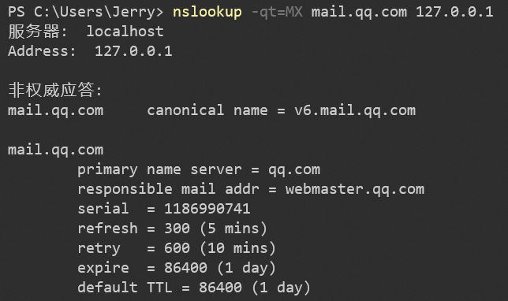

<center><b><font size ='2'>Figure 21. nslookup - 4</font></b></center>

- Domains in the **blacklist** are disabled. For example, we can set Google as `0.0.0.0` and `::`, and try to query it.

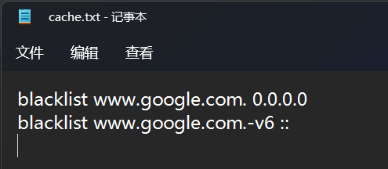

<center><b><font size ='2'>Figure 22. nslookup - 5</font></b></center>

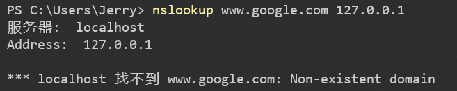

<center><b><font size ='2'>Figure 23. nslookup - 6</font></b></center>

### 4.2 Using Browser

We tried to make the DNS relay program perfect and competent in real-life, so we also tested the program with web brower.

To use this DNS relay with browser, users need to configure their network settings.

<center>
	
	
</center>

<center><b><font size ='2'>Figure 24 & 25. Network Config</font></b></center>

And then start the relay program and surf the Internet with browser. The operations of this DNS relay can be seen in the log file.

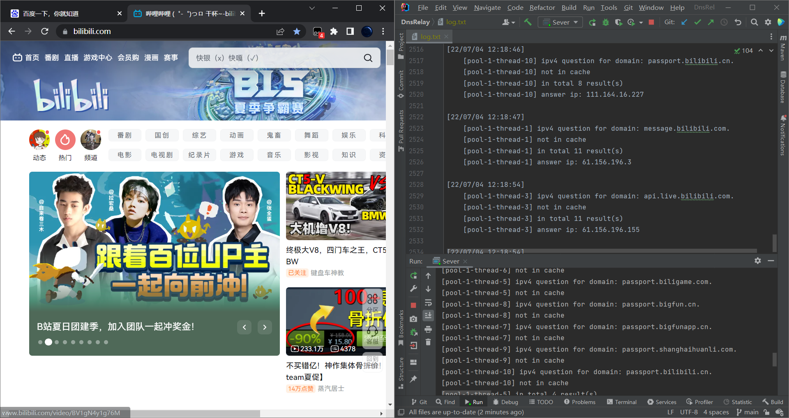

<center><b><font size ='2'>Figure 26. Broswer</font></b></center>

Using a web browser is quite different from simply using `nslookup` to test the DNS relay program, because webpages are **complicated** and often send a large number of "strange" request, just like the "passport.bigfun.cn" in the figure above. This is in essence challenging but our DNS relay can handle it very well.

### 4.3 Using Wireshark

Capturing message on port 53, we can see the packet format and content is completely same with or without our DNS relay. This means our program is highly **transparent** to the client.

## 5. Summary & Future Improvement

### 5.1. Summary

The DNS relay program is capable of handling various DNS query requests. On entering `nslookup example.com 127.0.0.1` in the terminal, the relay program receives the question from resolver and return with a answer from its local cache or remote DNS server. Apart from IPv4, the program has support for **IPv6** DNS query by returning type AAAA record, and it can also deal with records of other types including **NS, CNAME, and MX**. By using **a thread pool**, the server is able to handle multiple request at the same time. This **concurrency** configuration greatly helps improve the performance of the program. Mutex Lock is used to ensure **thread-safe** and avoid race condition.  In order to easy to burden or remote DNS server and speed up DNS look-up, the program uses a **cache** to store DNS query result for a preconfigured period of time and expired DNS cache is **automatically flushed**. The cache is supported by a **hash map** in the memory, which means any query in the cache can be done with time complexity of $O(1)$, and thus other threads is very unlikely to be blocked when they access the cache. This program also enables **load balancing**. If multiple IP addresses are found in cache or received from remote server (which means the Internet service has many servers for load balancing), it will randomly select one to send back to resolver. In this way, user programs access the service via different IP addresses and servers fairly. The use of **blacklist** can block undesired connection. When a domain on blacklist is queried, the relay program sets the RCODE to 3<sub>d</sub>, indicating no result is retrieved. This mechanism help improve Internet security. **Log** functions is used to record the connection and operations of the relay program. Users can track all query and response records in the log file.

In the process of our development, we went through **many challenges**. The first is to fully understand the flow pattern and datagram format of DNS. With the help of Wireshark, we **observed many DNS datagrams** and concluded what information is contained. This is very useful when we decapsulate the message in our program. When writing the request handler module, we found that the resolver must be able to **deal with all possible question types**. But it involves too many codes if we deal with the various type one by one. We took **many efforts** to solve this problem. Our **solution** is to combine all types but A and AAAA into one case. This simplification is based on our finding that they use same data flow, that we just need to simply relay the response we get from remote DNS server to the client. In this way, we only need to take close to type A and AAAA questions. Since we can handle all possible question types, the DNS relay program **can be used in real-life**. Compared with `nslookup`, web browsers often send a larger number and wider range of DNS request. Although it is complicated, our DNS relay can **work very well to support web browsers**, which in turn proves the **integrity** of our DNS relay program.

### 5.2. Room for Improvements

- Blacklist can be separate from cache so that it can be maintained more conveniently
- Log can be clearable in case the file is very large
- Cache size limit can be used to restrain memory usage
- Request receiving can use `BlockingQueue` Interface to deal with enormous traffic (, which is unlikely to happen on localhost but would be useful if deployed as a public remote DNS server). 

