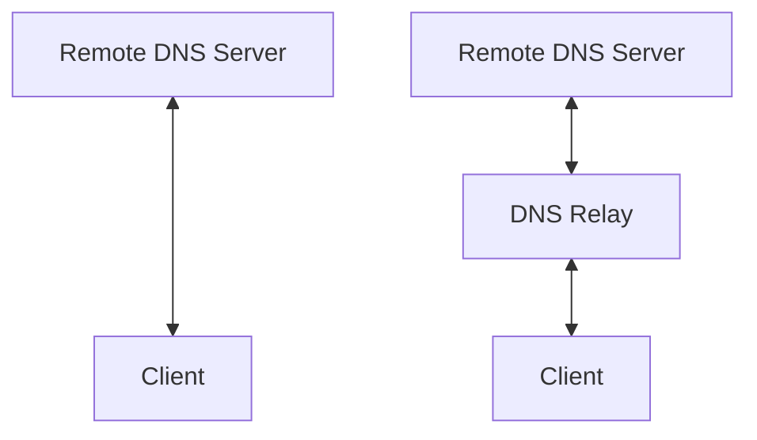
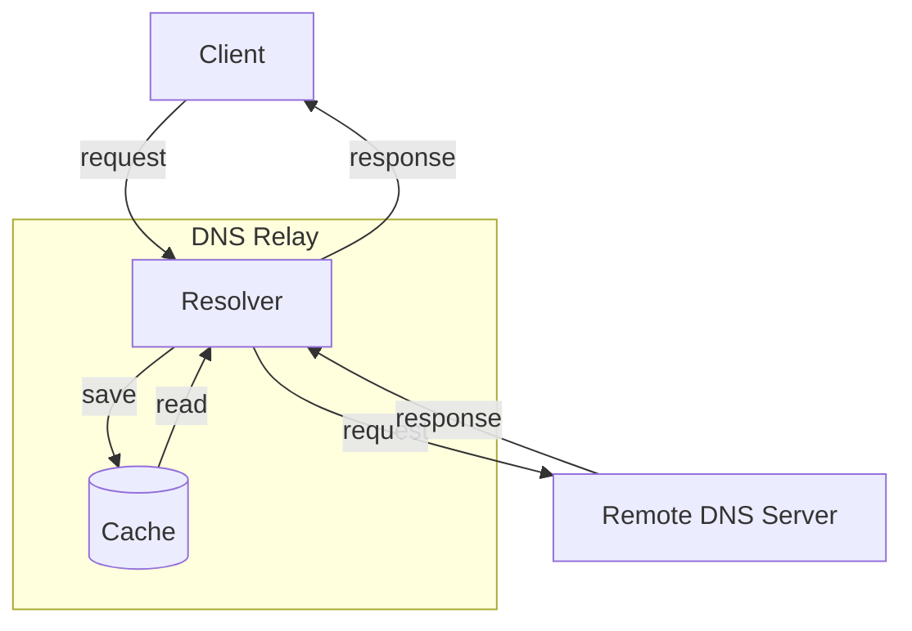
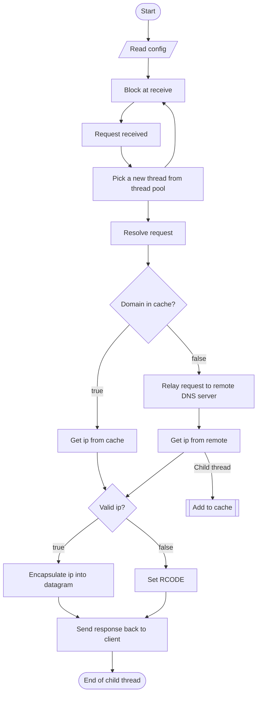

# REPORT OF DNS RELAY SERVER

**Course Title:** Design and implementation of a DNS Relay

**Group Member:**

- Wang Zaitian (2019213481)
- Zhang Zeyu (2019213482)

**Date:** 2022/7/2

[TOC]

## 0. Overview

The aim of this project is to design and implement a DNS relay that connects clients with remote DNS servers. Typically, when a user program is trying to interact with the domain name space, it send queries directly to the remote DNS server. In this design, the DNS relay works as a local DNS server or resolver whom the clients resort to, and takes the role of connecting to remote DNS server. The new domain system configuration has two benefits. First, it can ease the burden or remote DNS servers by replying to clients with its own DNS cache. Second, it increase Internet connection speed by using local DNS cache, which is faster than remote DNS server. Third, it can block some undesired connection to the Internet by adding certain domain names to blacklist.

## 1. Requirement Analysis

### 1.1. Functional Requirements

The DNS relay should be able to:

1. Listen to port 53 for DNS queries
2. Receive and resolve DNS query messages
3. Retrieve IPs for the domain name queried in local cache
4. Query the remote DNS server if IP not found in cache
5. Receive remote DNS server reply and fetch the returned IPs
6. Pack the IP from cache or remote DNS server in a reply message
7. Respond the resolver with this message containing the IP address
8. Block queries for domains that are recorded in blacklist
9. Support multi-threading to given best performance
10. Log connection and  operation information.

### 1.2. Non-functional Requirements

1. The software works on **Windows** or Linux
2. The program is written is C, C++, or **Java**

## 2. Overall Design

### 2.1. Basic Principles

#### 2.1.1. Function of DNS Relay

The DNS relay server is deployed between client and remote DNS server *(Figure 1)*. By adding additional functional modules to this server, we can achieve **additional functions** such as local caching, blacklisting, traffic control, etc.



<center><b><font size ='2'>Figure 1. Traditional & DNS relay</font></b></center></font>

#### 2.1.2. Data Flow

The *Figure 2* below shows the data flow of the whole system.



<center><b><font size ='2'>Figure 2. Functional modules</font></b></center></font>

Client first send an capsulate UDP datagram request to the resolver. The resolver decapsulate it and check if the request domain is cached. If the result is found in cache, then encapsulate it into the packet and send it back to the client. Otherwise, it should relay the request to the remote DNS server, then pass the server's response back to the client. Note that this is just the basic structure of DNS relay which only add a function of local caching.

#### 2.1.3. DNS Datagram

We import a maven dependency [DNSJava](https://mvnrepository.com/artifact/dnsjava/dnsjava) to extract information from DNS datagram conveniently. But we must first have a good understanding about each section of the datagram.

##### 2.1.3.1. DNS Header

The header section of DNS datagram is shown in *Figure 3*. ID is randomly generated by client. And flags indicate some properties of the datagram. The this specific DNS relay application, We only need to care about the **RCODE**. When we get no result for the requested domain or the domain is in the blacklist, we should set RCODE to 3<sub>d</sub>, which means no result. The rest of the header section only needs to be **cloned** to the response datagram without modification.

```
 0  1  2  3  4  5  6  7  8  9  10 11 12 13 14 15
+--+--+--+--+--+--+--+--+--+--+--+--+--+--+--+--+
|                      ID                       |
+--+--+--+--+--+--+--+--+--+--+--+--+--+--+--+--+
|QR|  opcode   |AA|TC|RD|RA|   Z    |   RCODE   |
+--+--+--+--+--+--+--+--+--+--+--+--+--+--+--+--+
```

<center><b><font size ='2'>Figure 3. DNS Header</font></b></center></font>

##### 2.1.3.2. DNS Question

*Figure 4* below shows the structure of DNS question section. **QNAME** contains the requested domain. For example, `www.github.com` is represented as `3www6github3com0`. **QTYPE** indicates different question types. *Table 1* shows the QTYPE that commonly used. QCLASS  = 1 means internet data.

```
 0  1  2  3  4  5  6  7  8  9  10 11 12 13 14 15
+--+--+--+--+--+--+--+--+--+--+--+--+--+--+--+--+
|                    QNAME                      |
+--+--+--+--+--+--+--+--+--+--+--+--+--+--+--+--+
|                    QTYPE                      |
+--+--+--+--+--+--+--+--+--+--+--+--+--+--+--+--+
|                    QCLASS                     |
+--+--+--+--+--+--+--+--+--+--+--+--+--+--+--+--+
```

<center><b><font size ='2'>Figure 4. DNS Question</font></b></center></font>

| Type  | Code in Decimal | Description            |
| ----- | --------------- | ---------------------- |
| A     | 1               | Request IPv4 address   |
| AAAA  | 28              | Request IPv6 address   |
| CNAME | 5               | Request canonical name |
| PTR   | 12              | Request inverse DNS    |

<center><b><font size ='2'>Table 1. Common QTYPE</font></b></center></font>

##### 2.1.3.3. DNS Answer

We only need to fill the **RDLENGTH** and **RDATA** in the response packet while the rest of the sections only need to be simply cloned. The the DNS relay implementation, only ARecords and AAAARecords need to be attached. This can be achieved by simply call `addRecord()` function defined in DNSJava.

```
  0  1  2  3  4  5  6  7  8  9  10 11 12 13 14 15
 +--+--+--+--+--+--+--+--+--+--+--+--+--+--+--+--+
 |                     NAME                      |
 +--+--+--+--+--+--+--+--+--+--+--+--+--+--+--+--+
 |                     TYPE                      |
 +--+--+--+--+--+--+--+--+--+--+--+--+--+--+--+--+
 |                     CLASS                     |
 +--+--+--+--+--+--+--+--+--+--+--+--+--+--+--+--+
 |                      TTL                      |
 +--+--+--+--+--+--+--+--+--+--+--+--+--+--+--+--+
 |                    RDLENGTH                   |
 +--+--+--+--+--+--+--+--+--+--+--+--+--+--+--+--+
 |                     RDATA                     |
 +--+--+--+--+--+--+--+--+--+--+--+--+--+--+--+--+
```

<center><b><font size ='2'>Figure 5. DNS Question</font></b></center></font>

### 2.2. Overall Process



<center><b><font size ='2'>Figure ?????. Overall flowchart</font></b></center></font>

## 3. Detail Design

## 4. Testing & Results

## 5. Summary & Future Improvement

### 5.1. Summary

The DNS relay program is capable of handling various DNS query requests. On entering `nslookup example.com localhost` in `cmd`, the relay program receives the question from resolver and return with a answer from its local cache or remote DNS server. Apart from IPv4, the program has support for **IPv6** DNS query by returning type AAAA record, and it can also deal with records of other types including **NS, CNAME, and MX**. By using **a thread pool**, the server is able to handle multiple request at the same time. This **concurrency** configuration greatly helps improve the performance of the program. Mutex Lock is used to ensure **thread-safe** and avoid race condition.  In order to easy to burden or remote DNS server and speed up DNS look-up, the program uses a **cache** to store DNS query result for a preconfigured period of time and expired DNS cache is **automatically flushed**. The cache is supported by a **hash map** in the memory, which means any query in the cache can be done with time complexity of $O(1)$, and thus other threads is very unlikely to be blocked when they access the cache. This program also enables **flow control**. If multiple IP addresses are found in cache or received from remote server (which means the Internet service has many servers for load balancing), it will randomly select one to send back to resolver. In this way, user programs access the service via different IP addresses and servers fairly. **Log** functions is used to record the connection and operations of the relay program. Users can track all query and response records in the log file.

### 5.2. Room for Improvements

- Blacklist can be separate from cache so that it can be maintained more conveniently
- Log can be clearable in case the file is very large
- Cache size limit can be used to restrain memory usage
